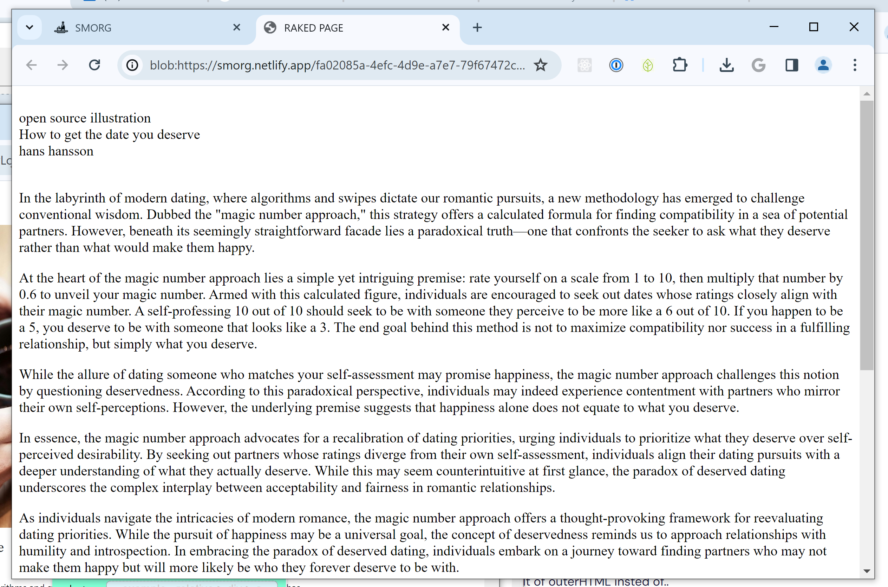
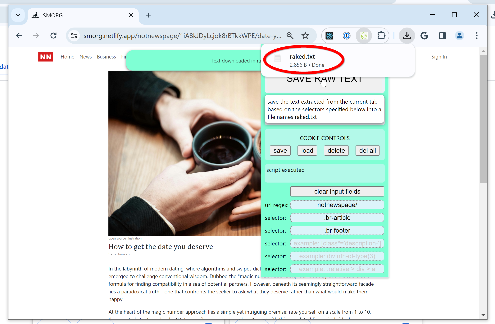

# RAKE

Chrome extension for scraping text from currently open tab according to user-defined query selectors. The extracted text can either be saved in a text file or displayed in a new tab.

# How to use

- Pin the extension to the chrome extension bar so that the icon is visible.

  

- Navigate to the url you wish to capture text content from and keep that tab open as the active tab.

- Click on the icon to open the extension popup window.

  

- If the user had previously extracted text from this url, the url regex and selector input fields should auto-populate. If the input fields are not auto-populated, type in a string that matches the current url. For example, the string "notnewspage" will match the current url of "https://smorg.netlify.app/notnewspage/1iA8kJDyLcjok8rBTkkWPE/date-you-deserve"

  

- Enter query selectors for the elements to extract innerText from. For example, `.br-title` will match with `
Asparagus Milk Tea
` and extract the text `Asparagus Milk Tea`.

- Click `OPEN NEW TAB` to display the selected elements in a new tab.

  

- Click `SAVE RAW TEXT` to save the raw text in a text file instead. The file name is `raked.txt`.

  

  

# Features

- Hover over the buttons to display the tooltips

  

- A ribbon that is appended to the current tab shows message regarding the action taken by the extension.

- Cookie Controls
  - The user can save the url regex and selectors in a cookie. A single cookie named `rakeJSON` carries the selector information for all url's.
  - If the selectors for a url has already been saved, loading that url will automatically load those selectors from the cookie when the extension loads.
  - Clicking `save` will override only the part of the cookie that pertains to the url of the currently open tab.
  - Click `delete` to remove the selector data for only the current url.
  - Click `del all` to delete `rakeJSON`.

# Upcoming features in v1.02

- Clicking on `COOKIE CONTROLS` shows list of url regex strings stored in cookie in the popup dev console.

- New tab removes all svg tags.

# Notes

- The url regex string is matched against the url, but it does not work with regular expressions yet.

- To run this extension without publishing...
  - Clone the repo
  - Navigate to chrome://extensions/
  - Turn on Developer mode
  - Click on Load unpacked
  - Select 'rake', the location of this project

## Privacy Policy

This chrome extension stores url and query selector data locally in a cookie. This chrome extension does not collect any user data. See [privacy policy](https://www.freeprivacypolicy.com/live/e57e694f-b71e-430e-8e04-5268a7bcd780).

## License

MIT License
